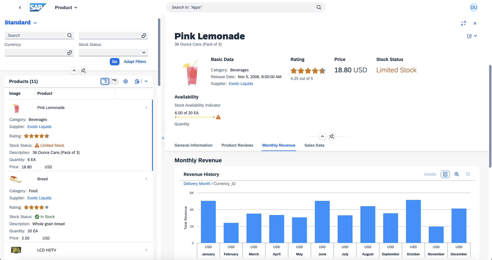

# SAP Fiori Elements and RAP Model

This is a sample project for SAP Fiori Elements app with RAP-based OData service. Here's an introductory blog post about this sample project -- [SAP Fiori Elements using RAP Model](https://blogs.sap.com/2023/04/03/sap-fiori-elements-using-rap-model/).



## GETTING STARTED

This project is already available in BTP ABAP Trial environment, however, if you wish to use this in your own private instance of BTP ABAP environment then make sure to refer to the steps below:

- You have installed the [abapGit](https://eclipse.abapgit.org/updatesite/) plugin in your ADT
- Create a package `ZRFES`
- Link this repository [https://github.com/jcailan/rap-fe-samples](https://github.com/jcailan/rap-fe-samples)
- Pull the source codes and then Activate the ABAP objects
- Publish the service bindings `ZUI_PRODUCTS_RS_O2` and `ZUI_PRODUCTS_RS_O4`
- Generate data by executing class `ZCL_DATA_GENERATOR_RS`

## TESTING

You can test the RAP-based OData service by using the `Preview` feature of the respective Service Bindings. However, if you wish to test using an actual Fiori Element app generated by Fiori Tools, then you can generate your own or use the [Display Products](app/products/) app that comes together in this repository.

- Search and Replace All for the entire project folder below string:

```html
<your-abap-server-url>
```

- Run the app:

```shell
# change directory
> cd app/products
# install dependencies
> npm install
# run the app
> npm start
```

## APPENDIX

- [MIT License](LICENSE)